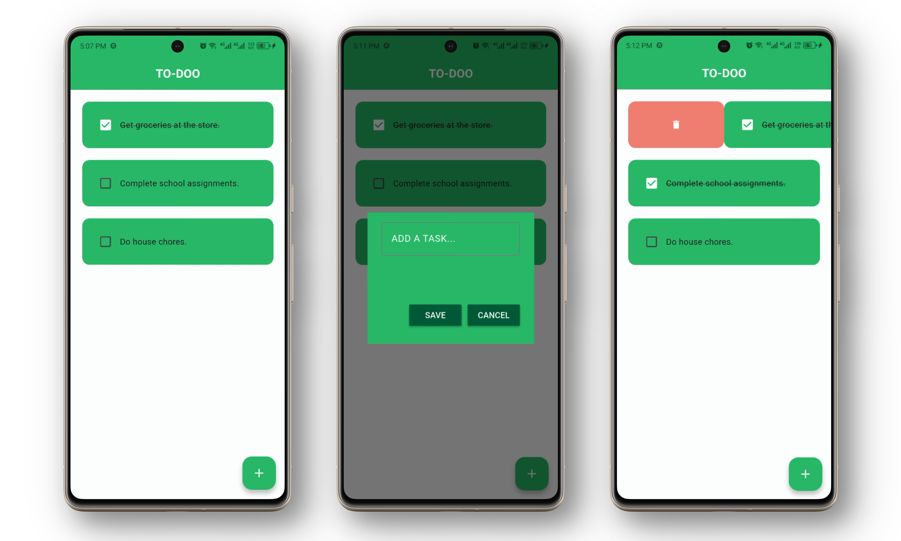

# TO-DOO APP

This is a simple __todo app__ built with __Dart__ and __Flutter__. It lets you keep track of your daily tasks. It features a simple UI and UX that lets your add/view tasks, persist task data, and delete tasks upon completion.  

---
  
 
Feel free to use this **codebase** and modify the resulting **app** as you see fit. [;)] 